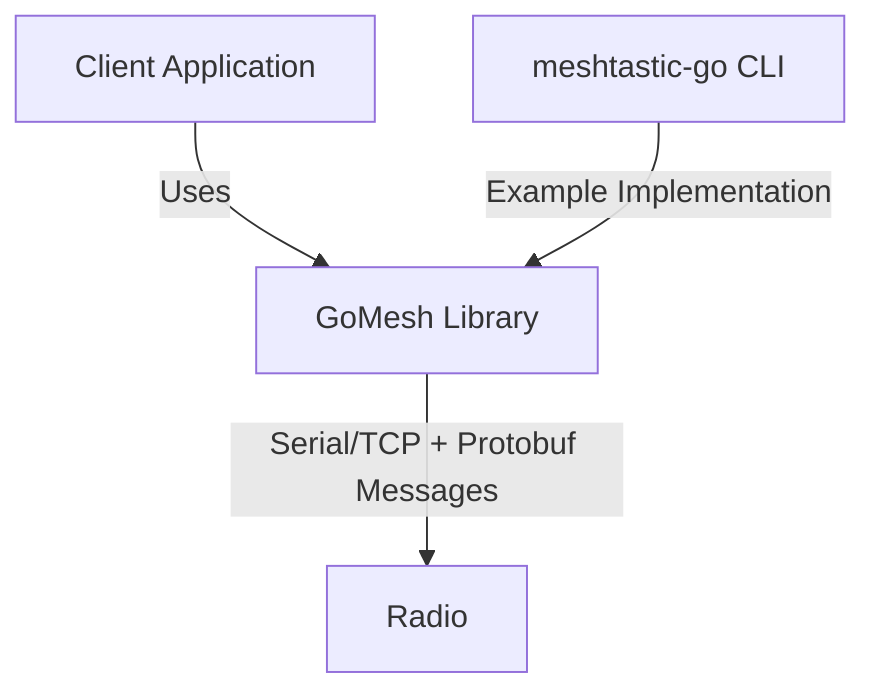
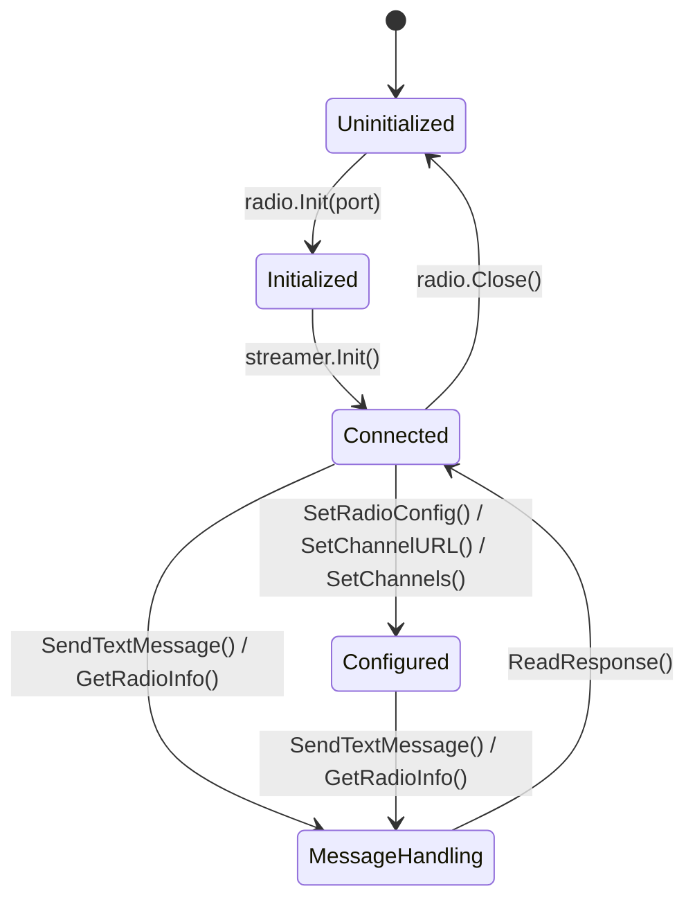
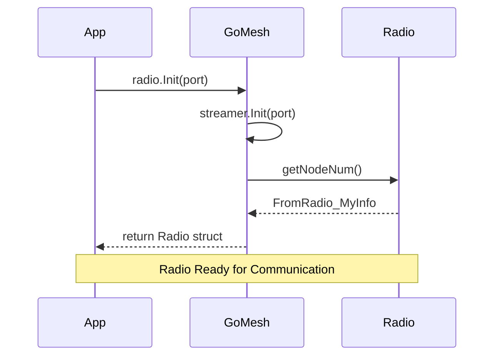
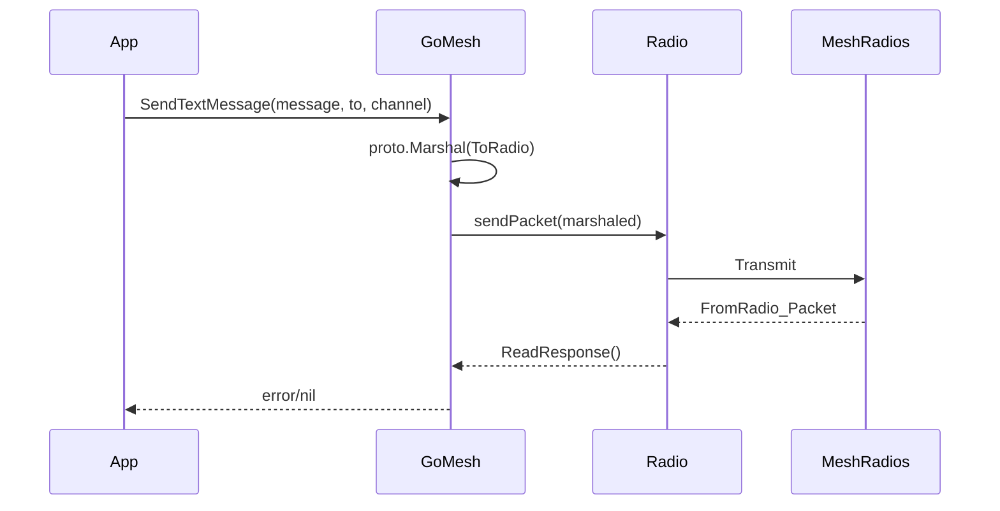
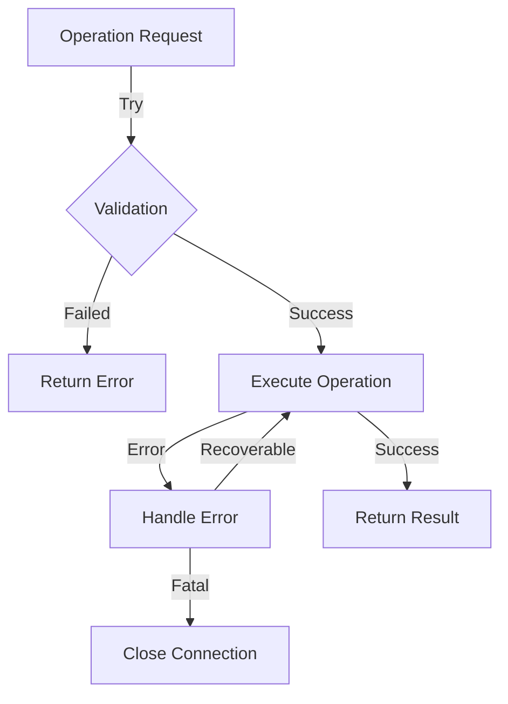

# GoMesh Design Document

## Overview
GoMesh is a Go package designed to provide a high-level interface for interacting with Meshtastic radio devices. This document outlines the architecture and design decisions of the GoMesh library, intended for developers who want to understand or contribute to the project.

## System Context


## Core Components

### 1. Radio Interface
The core of the system is the `Radio` struct, which handles all communication with Meshtastic devices.

#### State Diagram


### 2. Communication Layer
The library supports two communication methods:
- Serial communication for direct USB connections
- TCP communication for network-connected devices

#### Sequence Diagram - Device Initialization


### 3. Protocol Buffer Integration
The system uses Protocol Buffers for structured data communication:

Key message types:
- FromRadio messages (device to host)
- ToRadio messages (host to device)
- Configuration messages
- Channel settings
- Node information

### 4. Major Subsystems

#### 4.1 Channel Management
Handles:
- Channel configuration
- PSK (Pre-Shared Key) management 
- Channel roles and permissions

#### 4.2 Message Handling
Capabilities:
- Send/receive text messages
- Handle broadcast messages
- Message routing between nodes

#### 4.3 Device Configuration
Features:
- Radio preferences
- User settings
- Location services
- Metrics collection

## Data Flow

### Message Flow


## Security Considerations

1. Channel Security
   - PSK (Pre-Shared Key) encryption
   - Channel access controls
   - Role-based permissions

2. Communication Security
   - Serial port access control
   - Network connection security for TCP

## Error Handling

The library implements comprehensive error handling:
- Connection failures
- Protocol errors
- Configuration validation
- Message transmission errors

### Error Flow


## Performance Considerations

1. Connection Management
   - Efficient handle of serial/TCP connections
   - Connection pooling for multi-device scenarios
   - Resource cleanup

2. Message Processing
   - Efficient protobuf serialization/deserialization
   - Asynchronous message handling
   - Buffer management

## Extension Points

The library is designed to be extensible in several areas:
1. New message types
2. Additional transport protocols
3. Custom channel configurations
4. Enhanced security features

## Testing Strategy

1. Unit Tests
   - Individual component testing
   - Mock device interactions
   - Protocol buffer handling

2. Integration Tests
   - Real device communication
   - Multi-device scenarios
   - Network conditions handling

## Dependencies

Core dependencies:
1. Protocol Buffers (protobuf)
2. Serial communication libraries
3. Network handling packages

## Example Implementation

The meshtastic-go CLI tool serves as a reference implementation of the GoMesh library, demonstrating:
1. Device initialization
2. Channel management
3. Message handling
4. Configuration management
5. Error handling

## Best Practices for Implementation

1. Always defer connection closure:
```go
radio := Radio{}
radio.Init(portName)
defer radio.Close()
```

2. Handle all error cases:
```go
responses, err := radio.GetRadioInfo()
if err != nil {
    // Handle error appropriately
    return err
}
```

3. Validate configurations before applying:
```go
if err := radio.ValidateChannelSettings(settings); err != nil {
    return err
}
```

## Future Considerations

1. Enhanced Features
   - Batch operations
   - Advanced routing capabilities
   - Extended metrics collection

2. Potential Improvements
   - Connection resilience
   - Performance optimizations
   - Additional security features

## Documentation Guidelines

1. Code Documentation
   - All exported functions must be documented
   - Include usage examples
   - Document error conditions

2. API Documentation
   - Clear parameter descriptions
   - Error scenarios
   - Usage examples

---

This design document is a living document and should be updated as the library evolves. Contributors should ensure that any significant changes are reflected in this document to maintain its usefulness as a reference for developers.
