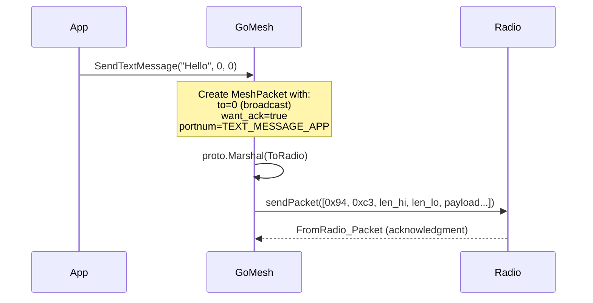
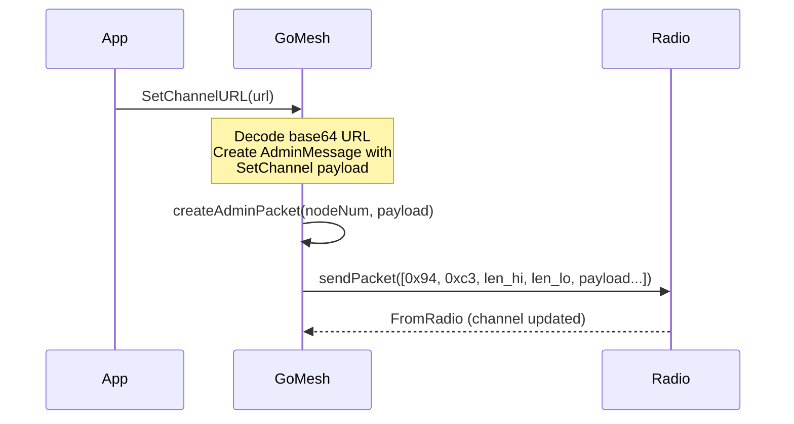
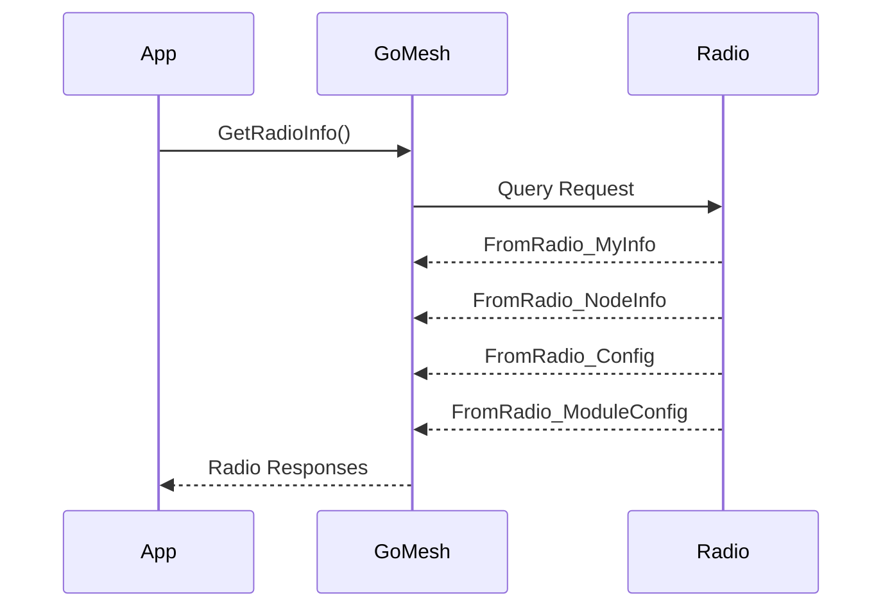
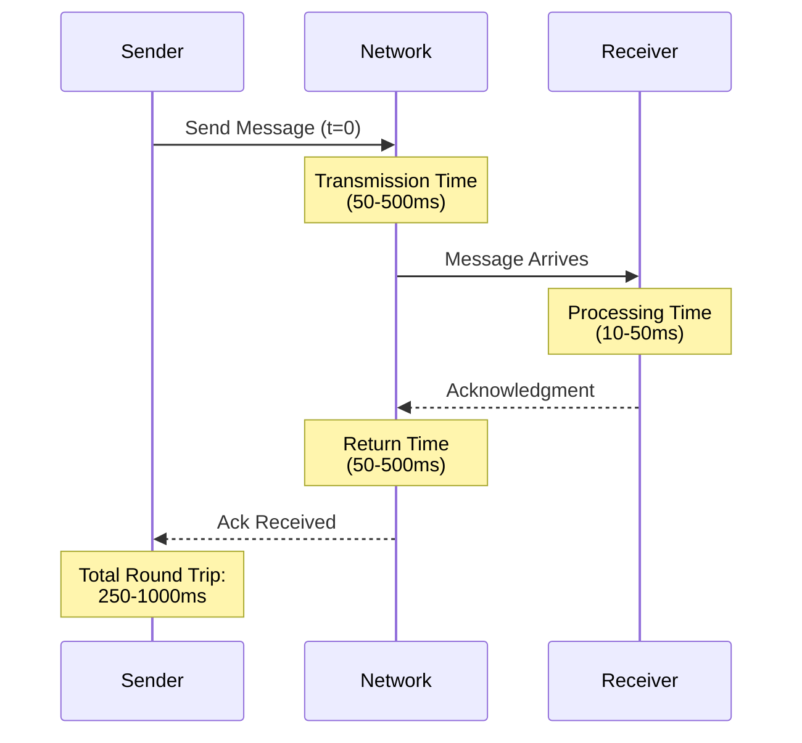
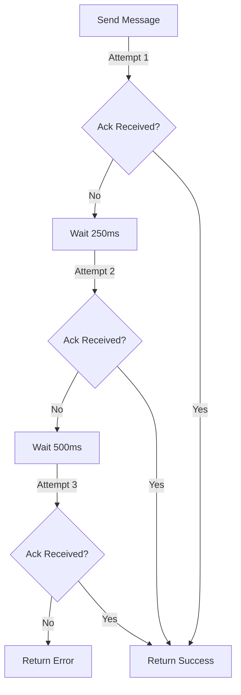

# GoMesh Design Document

## Overview
GoMesh is a Go package designed to provide a high-level interface for interacting with Meshtastic radio devices. This document outlines the architecture and design decisions of the GoMesh library, intended for developers who want to understand or contribute to the project.

## System Context


## Core Components

### 1. Radio Interface
The core of the system is the `Radio` struct, which handles all communication with Meshtastic devices.

#### State Diagram


### 2. Communication Layer
The library supports two communication methods:
- Serial communication for direct USB connections
- TCP communication for network-connected devices

#### Sequence Diagram - Device Initialization


### 3. Protocol Buffer Integration
The system uses Protocol Buffers for structured data communication:

Key message types:
- FromRadio messages (device to host)
- ToRadio messages (host to device)
- Configuration messages
- Channel settings
- Node information

### 4. Major Subsystems

#### 4.1 Channel Management
Handles:
- Channel configuration
- PSK (Pre-Shared Key) management 
- Channel roles and permissions

#### 4.2 Message Handling
Capabilities:
- Send/receive text messages
- Handle broadcast messages
- Message routing between nodes

#### 4.3 Device Configuration
Features:
- Radio preferences
- User settings
- Location services
- Metrics collection

## Data Flow

### Message Flow


## Security Considerations

1. Channel Security
   - PSK (Pre-Shared Key) encryption
   - Channel access controls
   - Role-based permissions

2. Communication Security
   - Serial port access control
   - Network connection security for TCP

## Error Handling

The library implements comprehensive error handling:
- Connection failures
- Protocol errors
- Configuration validation
- Message transmission errors

### Error Flow


## Performance Considerations

1. Connection Management
   - Efficient handle of serial/TCP connections
   - Connection pooling for multi-device scenarios
   - Resource cleanup

2. Message Processing
   - Efficient protobuf serialization/deserialization
   - Asynchronous message handling
   - Buffer management

## Extension Points

The library is designed to be extensible in several areas:
1. New message types
2. Additional transport protocols
3. Custom channel configurations
4. Enhanced security features

## Testing Strategy

1. Unit Tests
   - Individual component testing
   - Mock device interactions
   - Protocol buffer handling

2. Integration Tests
   - Real device communication
   - Multi-device scenarios
   - Network conditions handling

## Dependencies

Core dependencies:
1. Protocol Buffers (protobuf)
2. Serial communication libraries
3. Network handling packages

## Example Implementation

The meshtastic-go CLI tool serves as a reference implementation of the GoMesh library, demonstrating:
1. Device initialization
2. Channel management
3. Message handling
4. Configuration management
5. Error handling

## Best Practices for Implementation

1. Always defer connection closure:
```go
radio := Radio{}
radio.Init(portName)
defer radio.Close()
```

2. Handle all error cases:
```go
responses, err := radio.GetRadioInfo()
if err != nil {
    // Handle error appropriately
    return err
}
```

3. Validate configurations before applying:
```go
if err := radio.ValidateChannelSettings(settings); err != nil {
    return err
}
```

## Future Considerations

1. Enhanced Features
   - Batch operations
   - Advanced routing capabilities
   - Extended metrics collection

2. Potential Improvements
   - Connection resilience
   - Performance optimizations
   - Additional security features

## Documentation Guidelines

1. Code Documentation
   - All exported functions must be documented
   - Include usage examples
   - Document error conditions

2. API Documentation
   - Clear parameter descriptions
   - Error scenarios
   - Usage examples

---

This design document is a living document and should be updated as the library evolves. Contributors should ensure that any significant changes are reflected in this document to maintain its usefulness as a reference for developers.

## Protocol Buffer Message Structures

The library uses several key protocol buffer message types for communication. Here are the main structures:

### ToRadio Messages (Host to Device)

1. Text Message Structure:
```protobuf
message ToRadio {
    oneof payload_variant {
        MeshPacket packet = 1;
    }
}

message MeshPacket {
    uint32 to = 1;          // Destination node ID (broadcast = 0xffffffff)
    bool want_ack = 2;      // Should recipient send an ack?
    uint32 id = 3;          // Unique packet ID
    uint32 channel = 4;     // Channel number
    oneof payload_variant {
        Data decoded = 8;    // The decoded packet contents
    }
}

message Data {
    bytes payload = 1;      // Raw bytes of payload
    PortNum portnum = 2;    // Protocol number for the packet
}
```

2. Admin Message Structure:
```protobuf
message AdminMessage {
    oneof payload_variant {
        Config set_config = 1;           // Set radio configuration
        Channel set_channel = 3;         // Set channel configuration
        ModuleConfig set_module_config = 5; // Set module configuration
    }
}
```

### FromRadio Messages (Device to Host)

1. Device Info Response:
```protobuf
message FromRadio {
    oneof payload_variant {
        MyInfo my_info = 1;            // Radio info response
        NodeInfo node_info = 2;        // Node information
        Config config = 3;             // Configuration data
        FromRadio_Packet packet = 4;   // Received packet
        ModuleConfig module_config = 7; // Module configuration
    }
}

message MyInfo {
    uint32 my_node_num = 1;    // Our node number
    bool has_gps = 2;          // True if we have a GPS
    uint32 max_channels = 3;    // Max number of channels
}
```

## Command Flows

### 1. Text Message Transmission



### 2. Channel Configuration



### 3. Device Information Request



### 4. Packet Format

All packets follow this structure:
1. Start bytes: [0x94, 0xc3]
2. Length bytes: [len_hi, len_lo] (big endian)
3. Protobuf payload: Serialized message

Example packet: 
```
[0x94][0xc3][00][1E][protobuf bytes...]
 |     |     |   |    |
 |     |     |   |    +-- Serialized protobuf message
 |     |     +---+------ Length (30 bytes) in big endian
 |     +---------------- Second start byte (0xc3)
 +-------------------- First start byte (0x94)
```

### 5. Error Response Format

Error responses are encoded in FromRadio messages with an error code and description:
```protobuf
message FromRadio {
    oneof payload_variant {
        string error = 5;        // Error message
        uint32 error_code = 6;   // Error code
    }
}
```

Common error codes:
- 1: Invalid packet format
- 2: Channel configuration error
- 3: Device not ready
- 4: Permission denied
- 5: Hardware error

## Timing and Retry Logic

### Message Transmission Timing

1. Initial Packet Send:
   - Packet assembly: < 1ms
   - Serial/TCP transmission: 10-50ms
   - Radio transmission: 50-500ms (depending on LoRa settings)

2. Acknowledgment Windows:
   - Short range: 250ms
   - Medium range: 500ms
   - Long range: 1000ms



### Retry Mechanism

1. Default Retry Parameters:
   ```go
   const (
       MaxRetries = 3
       InitialBackoff = 250 * time.Millisecond
       MaxBackoff = 2 * time.Second
   )
   ```

2. Exponential Backoff Algorithm:
   ```go
   currentBackoff = min(InitialBackoff * (2 ^ retryCount), MaxBackoff)
   ```

3. Retry Flow:


### Timing Considerations

1. Network Conditions:
   - Good conditions: < 500ms round trip
   - Poor conditions: Up to 2s round trip
   - Extreme range: Up to 5s round trip

2. Power States:
   - Active mode: Immediate response
   - Light sleep: +100ms latency
   - Deep sleep: Up to 1s latency

3. Queue Management:
   - Maximum queue size: 4 packets
   - Queue timeout: 30 seconds
   - Priority handling: Admin messages first

### Error Recovery

1. Transmission Failures:
   ```mermaid
   graph TD
       A[Send Failure] -->|Check| B{Error Type}
       B -->|Timeout| C[Retry with Backoff]
       B -->|Hardware| D[Reset Connection]
       B -->|Protocol| E[Resync]
       C -->|Max Retries| F[Report Failure]
       D -->|Success| G[Resume]
       D -->|Failure| F
       E -->|Success| G
       E -->|Failure| F
   ```

2. Recovery Steps:
   a. Connection lost:
      - Wait 1 second
      - Attempt reconnection
      - Reset device if needed
   
   b. Protocol error:
      - Clear buffers
      - Resynchronize
      - Reinitialize if needed

   c. Hardware error:
      - Reset connection
      - Reinitialize device
      - Report if persistent

### Performance Optimization

1. Message Batching:
   - Batch size: Up to 4 messages
   - Batch timeout: 100ms
   - Priority override: Yes

2. Channel Selection:
   - Primary channel: Highest priority
   - Secondary channels: Round-robin
   - Emergency channel: Always monitored

3. Resource Management:
   - Buffer size: 512 bytes
   - Keep-alive interval: 10 minutes
   - Connection timeout: 30 seconds
